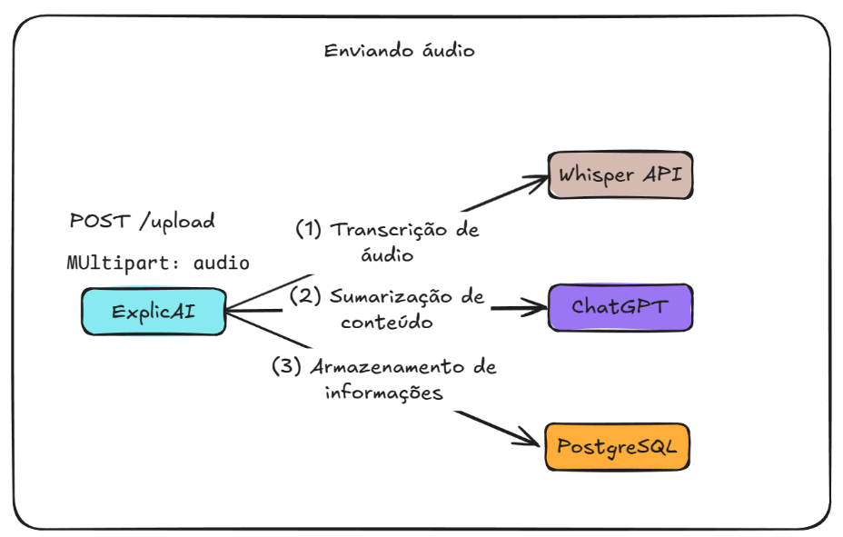

# ExplicAI

ExplicAI é uma API web inovadora que utiliza inteligência artificial para transformar áudios de reuniões em resumos claros e objetivos. O sistema permite que os usuários enviem gravações de reuniões, que são transcritas por uma API de reconhecimento de fala. Em seguida, o texto gerado é processado pelo ChatGPT para criar um resumo que destaca os principais tópicos e decisões tomadas. As transcrições e resumos são armazenados em um banco de dados, permitindo acesso fácil e organizado.



## Tecnologias Utilizadas
- Go
- Web
- Docker
- PostgreSQL
- LLM
- Speech-To-Text
- Concorrência
- Logging
- Testes unitários
- Testcontainers
- Mocks
- Middleware

## Endpoints da API

### `POST /upload`
Realiza o upload de um arquivo de áudio, iniciando o fluxo de transcrição, sumarização e armazenamento dos dados.

### `GET /summaries`
Lista todos os resumos gerados e armazenados no banco de dados.

### `GET /summaries/{externalId}`
Consulta um resumo específico pelo ID.

### `DELETE /summaries/{externalId}`
Exclui um resumo armazenado.

## Como Executar o Projeto

Execute os seguintes comandos para iniciar o projeto:
```bash
docker compose up -d
export OPEN_AI_API_KEY=chave_da_openai
go run cmd/main.go
```

## Instalação do Docker e Docker Compose (Ubuntu)

### 1. Atualizar Pacotes e Instalar Dependências
```bash
sudo apt-get update
sudo apt-get install -y ca-certificates curl gnupg lsb-release
```

### 2. Configurar o Repositório do Docker
```bash
sudo mkdir -p /etc/apt/keyrings
curl -fsSL https://download.docker.com/linux/ubuntu/gpg | sudo gpg --dearmor -o /etc/apt/keyrings/docker.gpg
echo "deb [arch=$(dpkg --print-architecture) signed-by=/etc/apt/keyrings/docker.gpg] https://download.docker.com/linux/ubuntu $(lsb_release -cs) stable" | sudo tee /etc/apt/sources.list.d/docker.list > /dev/null
sudo apt-get update
```

### 3. Instalar Docker e Componentes
```bash
sudo apt-get install -y docker-ce docker-ce-cli containerd.io docker-buildx-plugin docker-compose-plugin
```

### 4. Adicionar o Usuário ao Grupo Docker
```bash
sudo usermod -aG docker $USER
newgrp docker
```

### 5. Verificar Instalação
- **Docker:**
  ```bash
  docker --version
  docker run hello-world
  ```
- **Docker Compose (plugin):**
  ```bash
  docker compose version
  ```

## Conceitos Utilizados no Projeto

### Desenvolvimento Web com Go
- Construção de aplicações com o pacote `net/http`
- Criação de servidores HTTP e rotas
- Uso do framework Echo para roteamento e middleware
- Estruturação de projetos web
- Implementação de logs estruturados com Zap
- Criação de middlewares para validação e autenticação
- Gerenciamento de credenciais com Viper
- Tratamento aprimorado de erros

### Integração com APIs Externas
- Comunicação com serviços externos
- Uso da API Whisper para transcrição de áudio
- Integração com o ChatGPT para sumarização
- Implementação de testes para clientes HTTP usando `Testify` e `httptest`

### Integração com Bancos de Dados
- Persistência de dados utilizando PostgreSQL
- Criação e configuração do banco via Docker Compose
- Implementação de operações CRUD em Go
- Testes de integração utilizando `testcontainers`

### Implementação de Regras de Negócio
- Organização da camada de serviços
- Uso de Goroutines e `error group` para processamento concorrente
- Prevenção de `race conditions` com `Mutex`
- Operações assíncronas para transcrição e sumarização
- Implementação de testes unitários para `services` e `controllers`
- Uso do `mockery` para criação de mocks
- Medição de cobertura de testes e correção de bugs

## Consultando os Resumos

Para consultar os resumos diretamente no banco de dados PostgreSQL executando no Docker:

```bash
docker exec -it $(docker ps -q -f "name=db") psql -U admin -d explicai -c "SELECT * FROM summaries;"
```

